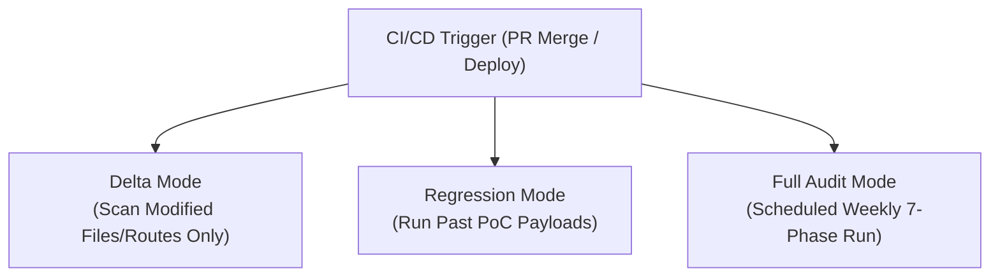

# Continuous & CI/CD Pentesting Execution Guide

To operationalize AI red-teaming as a continuous guardrail (Phase 3 of roadmap), integrate the pentest methodology into CI/CD pipelines and regression suites.

## 1. Execution Modes



### A. Delta Scan (Pull Request / Commit Trigger)
Run on every PR or commit to prevent new vulnerabilities before merge.
1. Use `git diff --name-only origin/main...HEAD` to identify changed files.
2. Filter for endpoint handlers, mobile screens, or API client files.
3. Execute Phase 3 (Vulnerability Analysis) and Phase 4 (Exploitation) **only** on the modified routes or UI components.

### B. Regression Verification (Post-Remediation Trigger)
Automated testing to ensure previously fixed vulnerabilities do not reappear.
1. Maintain a registry of past confirmed PoC payloads (`.agents/security/regression_pocs.json`).
2. On deploy to staging, replay all PoC payloads against the target.
3. If any PoC payload successfully executes and returns the exploitable response, fail the build immediately.

### C. Full Scheduled Audit (Weekly / Monthly Trigger)
Run the full 7-phase PTES-aligned assessment across backend, frontend, and mobile platforms in a dedicated staging environment.

---

## 2. CI/CD Integration Configurations

### GitHub Actions Workflow Template (`.github/workflows/ai-pentest.yml`)
```yaml
name: AI Security Pentest Guardrail
on:
  pull_request:
    paths:
      - 'src/**'
      - 'app/**'
      - 'backend/**'
  schedule:
    - cron: '0 2 * * 0' # Weekly on Sundays at 2am

jobs:
  security-audit:
    runs-on: ubuntu-latest
    steps:
      - name: Checkout Code
        uses: actions/checkout@v4
        with:
          fetch-depth: 0 # Needed for delta analysis

      - name: Setup Environment
        uses: actions/setup-node@v4
        with:
          node-version: 20

      - name: Run Delta Recon & SAST
        env:
          ANTHROPIC_API_KEY: ${{ secrets.ANTHROPIC_API_KEY }}
        run: |
          npx @keygraph/shannon start -r . --delta-only

      - name: Run Dynamic Exploitation Probes against Local Staging
        run: |
          docker compose up -d staging-env
          # Run dynamic probing suite
          npx @keygraph/shannon exploit -u http://localhost:3000

      - name: Check Hacker Score & Fail Gate
        run: |
          SCORE=$(cat workspaces/latest/session.json | jq .hackerScore)
          echo "Hacker Score: $SCORE"
          if [ "$SCORE" -lt 70 ]; then
            echo "🔴 Security gate failed! Hacker score below threshold."
            exit 1
          fi
```

---

## 3. Continuous Mobile Interception Testing

For mobile apps in CI/CD (Bitrise, GitHub Actions, GitLab CI):
1. Spawn headless Android Emulator or iOS Simulator in the CI runner.
2. Start `mitmproxy` in background mode, dumping traffic to `traffic.flow`.
3. Execute automated UI test flows (Appium or Maestro) to exercise app functionality.
4. AI agent parses `traffic.flow` to inspect all outbound mobile API calls for plaintext secrets, missing auth headers, and insecure endpoints.
5. AI agent verifies if certificate pinning was successfully enforced by checking proxy handshake failures.
