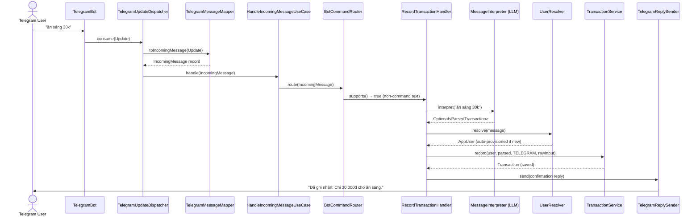

# IOM (Input Output Money) — Project Architecture & Guide

> **Purpose**: Context handover document. Read this file to understand the full project architecture, current implementation status, design decisions, and conventions — without needing prior conversation history.

---

## Read Order

- Read this file for the broad project architecture and module inventory.
- Read [`docs/BOT_FLOW.md`](BOT_FLOW.md) first when working on Telegram routing, bot replies, transaction parsing, summary intents, or command handler tests.
- `BOT_FLOW.md` is intentionally shorter and should be kept up to date after bot behavior changes.

---

## 1. Project Overview

- **Project Name**: IOM (Input Output Money)
- **Goal**: A multi-channel personal finance assistant. Users record incomes and expenses by sending natural language chat messages (e.g., `"ăn sáng 30k"`, `"lunch $12"`) instead of filling out forms. The system uses an LLM to parse messages into structured financial data.
- **Primary Channel**: Telegram Bot (Phase 1). Web dashboard planned for Phase 2+.
- **Design Philosophy**: Core business logic is platform-independent. External channels (Telegram, Web, Zalo, etc.) are Input/Output adapters. Adding a new channel requires zero changes to core logic.

---

## 2. Tech Stack

| Layer | Technology |
|-------|-----------|
| Language | Java 21 (Virtual Threads for I/O concurrency) |
| Framework | Spring Boot 4.0.6 |
| Database | PostgreSQL 17 (`postgres:17-alpine`) |
| ORM & Migration | Spring Data JPA & Flyway |
| Object Mapping | MapStruct 1.6.3 (all cross-layer mapping, no manual `new`) |
| Bot Integration | Telegram Long Polling (`telegrambots-springboot-longpolling-starter` 9.6.0) |
| Security | Spring Security + OAuth2 Client & Resource Server (JWT via header or cookie) |
| Build | Maven (wrapper at `api/mvnw.cmd`) |
| Containerization | Docker & Docker Compose |
| i18n | Spring MessageSource (`messages.properties`) |

---

## 3. Architecture

The project follows **Hexagonal Architecture** (Ports & Adapters) with **Strategy Pattern**, **Chain of Responsibility**, and **Sealed Classes** as primary design patterns.

### 3.1 Layer Diagram

```text
channel/telegram/            External Adapter (inbound)
        │
application/usecase/         Use Case orchestration
        │
application/command/         Strategy routing (BotCommandHandler implementations)
        │
  ┌─────┴─────┐
  │            │
domain/      application/port/out/
  message/     MessageInterpreter   ← Strategy port (LLM parsing)
  transaction/ UserResolver         ← Strategy port (user lookup)
  summary/     DateRangeResolver    ← Chain of Responsibility port
  conversation/ActionResolver       ← Chain of Responsibility port
  user/        ConversationContextStore ← Strategy port (context storage)
               MessageSender        ← Port (reply sending)
  │
service/                     Infrastructure adapters (implements ports)
  LlmMessageInterpreter       implements MessageInterpreter
  KeywordDateResolver          implements DateRangeResolver (Order 1)
  LlmDateRangeResolver         implements DateRangeResolver (Order 2)
  DateRangeResolverChain       orchestrates DateRangeResolver chain
  KeywordActionResolver        implements ActionResolver (Order 1)
  ActionResolverChain          orchestrates ActionResolver chain
  InMemoryConversationContextStore implements ConversationContextStore
  DefaultUserResolver          implements UserResolver
  TransactionService           business logic (composition)
  mapper/                      MapStruct mappers
  │
repository/                  Data access (Spring Data JPA)
```

**Dependency Rule**: `domain/` has zero imports from `channel/`, `service/`, or `repository/`. Ports (interfaces) live in `application/port/out/`. Adapters live in `service/` or `channel/`.

### 3.2 Telegram Message Flow



### 3.3 Command Handler Chain (Strategy Pattern)

Handlers are matched in `@Order` priority. A handler returns `true` when it handled the
message and `false` when the router should continue to the next matching handler.

| Order | Handler | Matches |
|-------|---------|---------|
| 1 | `StartCommandHandler` | `/start` |
| 2 | `HelpCommandHandler` | `/help` |
| 3 | `TodaySummaryHandler` | `/today` |
| 4 | `MonthSummaryHandler` | `/month` |
| 10 | `UnknownCommandHandler` | Any unrecognized `/command` |
| 50 | `RecordTransactionHandler` | Non-command text with financial data |
| 60 | `ManageTransactionHandler` | Delete / update / undo / confirm / cancel |
| 80 | `ViewFinancesHandler` | Natural-language summary/history requests (pipeline) |
| 99 | `EchoMessageHandler` | Any remaining text (fallback guidance) |

`RecordTransactionHandler` calls `MessageInterpreter.interpret()`. If the LLM returns empty
(not a financial message), it returns `false`, letting the router fall through to
`ManageTransactionHandler`, then `ViewFinancesHandler`, then `EchoMessageHandler`.

---

## 4. Database Schema

Three tables managed by Flyway migrations in `api/src/main/resources/db/migration/`:

### app_users (V1)
| Column | Type | Notes |
|--------|------|-------|
| id | BIGSERIAL PK | |
| email | VARCHAR(255) UNIQUE | Nullable (Telegram users have no email initially) |
| password_hash | VARCHAR(255) | Nullable (OAuth/Telegram users) |
| first_name | VARCHAR(35) | |
| last_name | VARCHAR(20) | |
| avatar_url | TEXT | |
| auth_provider | VARCHAR(20) | DEFAULT 'LOCAL'. Enum: `AuthProvider` |
| role | VARCHAR(20) | DEFAULT 'USER'. Enum: `Role {USER, ADMIN}` |
| is_active | BOOLEAN | DEFAULT TRUE |
| created_at / updated_at | TIMESTAMPTZ | |

### external_accounts (V2)
| Column | Type | Notes |
|--------|------|-------|
| id | BIGSERIAL PK | |
| user_id | BIGINT FK → app_users | |
| platform | VARCHAR(20) | Enum: `MessageChannel {TELEGRAM}` |
| external_user_id | VARCHAR(100) | Telegram user ID, etc. |
| display_name | VARCHAR(100) | |
| linked_at | TIMESTAMPTZ | |
| | UNIQUE | (platform, external_user_id) |

### transactions (V3)
| Column | Type | Notes |
|--------|------|-------|
| id | BIGSERIAL PK | |
| user_id | BIGINT FK → app_users | |
| type | VARCHAR(10) | Enum: `TransactionType {INCOME, EXPENSE}` |
| amount | BIGINT | Smallest currency unit (dong for VND, cents for USD) |
| currency | VARCHAR(5) | Enum: `Currency {VND, USD, EUR, JPY, KRW, GBP}` |
| category | VARCHAR(30) | Enum: `Category {FOOD, TRANSPORT, SALARY, EDUCATION, SHOPPING, ENTERTAINMENT, HEALTH, HOUSING, OTHER}` |
| note | VARCHAR(500) | Extracted description |
| raw_input | TEXT | Original user message |
| source_platform | VARCHAR(20) | Which channel the message came from |
| occurred_at | TIMESTAMPTZ | When the transaction happened |
| created_at / updated_at | TIMESTAMPTZ | |

**Index**: `idx_tx_user_occurred ON transactions(user_id, occurred_at)` — optimizes summary queries.

---

## 5. Key Design Decisions

| Decision | Rationale |
|----------|-----------|
| **LLM for parsing** (not regex) | Core parsing delegated to LLM via `MessageInterpreter` port. Handles Vietnamese natural language, multiple currencies, relative dates — far more robust than regex. |
| **DeepSeek via Spring AI** | Transaction parsing and LLM date resolution use Spring AI `ChatModel` with DeepSeek. Provider-specific types stay inside service adapters. |
| **Bot handlers return boolean** | `BotCommandHandler.handle()` returns `true` when handled and `false` when routing should continue. This lets transaction parsing fall through to finance view and fallback replies. |
| **Query Pipeline Architecture** | `ViewFinancesHandler` uses a 4-stage pipeline: DateRange resolution → FlowFilter/ViewMode detection → data fetching → rendering. Each stage follows SRP. |
| **Chain of Responsibility** | `DateRangeResolver` chain: `KeywordDateResolver` (deterministic, Order 1) → `LlmDateRangeResolver` (LLM fallback, Order 2). Add new resolvers by implementing `DateRangeResolver` with a new `@Order`. |
| **Sealed `FinanceQuery`** | `FinanceQuery.View` and `FinanceQuery.Clarification` — compiler-enforced exhaustive switch handling (Java 21). |
| **`DateRange` Value Object** | Immutable record with factory methods (`today()`, `yesterday()`, `daysAgo()`, `thisWeek()`, `thisMonth()`, `custom()`). Replaces scattered `Instant from/to` pairs. |
| **ViewMode auto-adjustment** | DETAIL with ≤10 transactions → COMPACT (list + totals). DETAIL with >10 → SUMMARY. Keeps Telegram replies readable. |
| **Category emoji** | `Category` enum has `emoji` field for detail view rendering (e.g., 🍜 FOOD, 🚗 TRANSPORT). |
| **Strategy Pattern** | Applied to command routing (`BotCommandHandler`), message interpretation (`MessageInterpreter`), user resolution (`UserResolver`), and finance view rendering (`FinanceViewRenderer`). |
| **MapStruct** for all mapping | No manual `new Entity(...)` for cross-layer conversions. Consistent with existing `TelegramMessageMapper`. Mappers: `TransactionMapper`, `UserMapper`. |
| **Multi-currency** from day one | `Currency` enum with formatting metadata (`symbol`, `groupSeparator`, `minorUnits`). Amounts stored in smallest unit. `AmountFormatter` is currency-aware. |
| **ConversationContext** | Per-user stateful session tracking `lastRecordedTransactionId`, `lastViewedTransactionIds`, and `pendingAction`. Platform-agnostic — same context works for Telegram, Web, Zalo. State Pattern: `IDLE → AWAITING_CONFIRMATION → IDLE`. |
| **TransactionReference sealed** | `Latest`, `ByIndex(int)`, `ByMatch(String)` — three ways to reference a transaction. Exhaustive switch ensures all cases handled at compile time. |
| **ActionResolver chain** | `KeywordActionResolver` (deterministic, Order 1) → `LlmActionResolver` (LLM fallback, Order 2 — future). Same Chain of Responsibility pattern as `DateRangeResolver`. |
| **Confirmation flow** | Delete/update actions require user confirmation before execution. `ManageTransactionHandler` manages state transitions via `ConversationContext`. |
| **Auto-provisioning users** | `DefaultUserResolver` creates `AppUser` + `ExternalAccount` on first Telegram message. No registration flow needed for bot usage. |
| **Externalized messages** | All Vietnamese bot reply text lives in `messages.properties` via Spring `MessageSource`. `BotMessages` component provides typed access. No hardcoded user-facing strings in Java code. |
| **No `@Data` on entities** | Per `spring-boot-data-access` skill. Entities use `@Getter`, `@Builder`, `@NoArgsConstructor(PROTECTED)`, `@AllArgsConstructor(PRIVATE)`. |
| **`@Transactional(readOnly=true)`** as default | Class-level on services. Write methods override with `@Transactional`. Per `spring-boot-data-access` skill. |

---

## 6. File Inventory

### 6.1 Channel Adapter (`channel/telegram/`)
| File | Purpose |
|------|---------|
| [TelegramBot.java](file:///d:/Long/project/iom/api/src/main/java/me/nghlong3004/iom/api/channel/telegram/TelegramBot.java) | Registers bot with Spring Long Polling |
| [TelegramUpdateDispatcher.java](file:///d:/Long/project/iom/api/src/main/java/me/nghlong3004/iom/api/channel/telegram/TelegramUpdateDispatcher.java) | Filters valid text updates |
| [TelegramMessageMapper.java](file:///d:/Long/project/iom/api/src/main/java/me/nghlong3004/iom/api/channel/telegram/TelegramMessageMapper.java) | MapStruct: Telegram Update → IncomingMessage |
| [TelegramReplySender.java](file:///d:/Long/project/iom/api/src/main/java/me/nghlong3004/iom/api/channel/telegram/TelegramReplySender.java) | Sends replies via OkHttpTelegramClient |

### 6.2 Application Layer (`application/`)
| File | Purpose |
|------|---------|
| [HandleIncomingMessageUseCase.java](file:///d:/Long/project/iom/api/src/main/java/me/nghlong3004/iom/api/application/usecase/HandleIncomingMessageUseCase.java) | Orchestrates message handling |
| [BotCommandRouter.java](file:///d:/Long/project/iom/api/src/main/java/me/nghlong3004/iom/api/application/command/BotCommandRouter.java) | Routes to first matching handler |
| [BotCommand.java](file:///d:/Long/project/iom/api/src/main/java/me/nghlong3004/iom/api/application/command/BotCommand.java) | Enum: START, HELP, TODAY, MONTH |
| [BotCommandHandler.java](file:///d:/Long/project/iom/api/src/main/java/me/nghlong3004/iom/api/application/command/BotCommandHandler.java) | Strategy interface: `supports()` + `handle()` |
| [StartCommandHandler.java](file:///d:/Long/project/iom/api/src/main/java/me/nghlong3004/iom/api/application/command/StartCommandHandler.java) | /start welcome |
| [HelpCommandHandler.java](file:///d:/Long/project/iom/api/src/main/java/me/nghlong3004/iom/api/application/command/HelpCommandHandler.java) | /help guide |
| [TodaySummaryHandler.java](file:///d:/Long/project/iom/api/src/main/java/me/nghlong3004/iom/api/application/command/TodaySummaryHandler.java) | /today — uses DateRange.today() + FinanceViewRenderer |
| [MonthSummaryHandler.java](file:///d:/Long/project/iom/api/src/main/java/me/nghlong3004/iom/api/application/command/MonthSummaryHandler.java) | /month — uses DateRange.thisMonth() + FinanceViewRenderer |
| [ViewFinancesHandler.java](file:///d:/Long/project/iom/api/src/main/java/me/nghlong3004/iom/api/application/command/ViewFinancesHandler.java) | Natural-language summary/history — pipeline architecture |
| [RecordTransactionHandler.java](file:///d:/Long/project/iom/api/src/main/java/me/nghlong3004/iom/api/application/command/RecordTransactionHandler.java) | Parses financial messages, records transactions |
| [EchoMessageHandler.java](file:///d:/Long/project/iom/api/src/main/java/me/nghlong3004/iom/api/application/command/EchoMessageHandler.java) | Fallback: guidance text for unrecognized input |
| [UnknownCommandHandler.java](file:///d:/Long/project/iom/api/src/main/java/me/nghlong3004/iom/api/application/command/UnknownCommandHandler.java) | Catches unrecognized slash commands |
| [MessageInterpreter.java](file:///d:/Long/project/iom/api/src/main/java/me/nghlong3004/iom/api/application/port/out/MessageInterpreter.java) | Port: natural language → ParsedTransaction |
| [DateRangeResolver.java](file:///d:/Long/project/iom/api/src/main/java/me/nghlong3004/iom/api/application/port/out/DateRangeResolver.java) | Port: text → Optional\<DateRange\> (Chain of Responsibility) |
| [UserResolver.java](file:///d:/Long/project/iom/api/src/main/java/me/nghlong3004/iom/api/application/port/out/UserResolver.java) | Port: IncomingMessage → AppUser |

### 6.3 Domain (`domain/`)
| File | Purpose |
|------|---------|
| [MessageChannel.java](file:///d:/Long/project/iom/api/src/main/java/me/nghlong3004/iom/api/domain/MessageChannel.java) | Enum: TELEGRAM (expandable) |
| [IncomingMessage.java](file:///d:/Long/project/iom/api/src/main/java/me/nghlong3004/iom/api/domain/message/IncomingMessage.java) | Record: channel, externalUserId, conversationId, text |
| [OutgoingMessage.java](file:///d:/Long/project/iom/api/src/main/java/me/nghlong3004/iom/api/domain/message/OutgoingMessage.java) | Record: channel, conversationId, text |
| [MessageSender.java](file:///d:/Long/project/iom/api/src/main/java/me/nghlong3004/iom/api/domain/message/MessageSender.java) | Port interface for sending replies |
| [DateRange.java](file:///d:/Long/project/iom/api/src/main/java/me/nghlong3004/iom/api/domain/summary/DateRange.java) | Value Object: immutable date range with factory methods |
| [ViewMode.java](file:///d:/Long/project/iom/api/src/main/java/me/nghlong3004/iom/api/domain/summary/ViewMode.java) | Enum: SUMMARY, DETAIL, COMPACT |
| [FlowFilter.java](file:///d:/Long/project/iom/api/src/main/java/me/nghlong3004/iom/api/domain/summary/FlowFilter.java) | Enum: ALL, EXPENSE, INCOME |
| [FinanceQuery.java](file:///d:/Long/project/iom/api/src/main/java/me/nghlong3004/iom/api/domain/summary/FinanceQuery.java) | Sealed interface: View \| Clarification |
| [TransactionType.java](file:///d:/Long/project/iom/api/src/main/java/me/nghlong3004/iom/api/domain/transaction/TransactionType.java) | Enum: INCOME, EXPENSE |
| [Category.java](file:///d:/Long/project/iom/api/src/main/java/me/nghlong3004/iom/api/domain/transaction/Category.java) | Enum with emoji: FOOD(🍜), TRANSPORT(🚗), etc. |
| [Currency.java](file:///d:/Long/project/iom/api/src/main/java/me/nghlong3004/iom/api/domain/transaction/Currency.java) | Enum with formatting metadata (symbol, groupSeparator, minorUnits) |
| [ParsedTransaction.java](file:///d:/Long/project/iom/api/src/main/java/me/nghlong3004/iom/api/domain/transaction/ParsedTransaction.java) | Validated record: type, amount, currency, category, note, occurredAt |
| [Transaction.java](file:///d:/Long/project/iom/api/src/main/java/me/nghlong3004/iom/api/domain/transaction/Transaction.java) | JPA entity mapped to `transactions` table |
| [AppUser.java](file:///d:/Long/project/iom/api/src/main/java/me/nghlong3004/iom/api/domain/user/AppUser.java) | JPA entity mapped to `app_users` table |
| [ExternalAccount.java](file:///d:/Long/project/iom/api/src/main/java/me/nghlong3004/iom/api/domain/user/ExternalAccount.java) | JPA entity linking platform accounts to AppUser |
| [Role.java](file:///d:/Long/project/iom/api/src/main/java/me/nghlong3004/iom/api/domain/user/Role.java) | Enum: USER, ADMIN |

### 6.4 Service (`service/`)
| File | Purpose |
|------|---------|
| [LlmMessageInterpreter.java](file:///d:/Long/project/iom/api/src/main/java/me/nghlong3004/iom/api/service/LlmMessageInterpreter.java) | MessageInterpreter adapter — LLM transaction parsing via DeepSeek |
| [KeywordDateResolver.java](file:///d:/Long/project/iom/api/src/main/java/me/nghlong3004/iom/api/service/KeywordDateResolver.java) | DateRangeResolver — deterministic keyword matching (Order 1) |
| [LlmDateRangeResolver.java](file:///d:/Long/project/iom/api/src/main/java/me/nghlong3004/iom/api/service/LlmDateRangeResolver.java) | DateRangeResolver — LLM fallback via DeepSeek (Order 2) |
| [DateRangeResolverChain.java](file:///d:/Long/project/iom/api/src/main/java/me/nghlong3004/iom/api/service/DateRangeResolverChain.java) | Orchestrates DateRangeResolver chain |
| [DefaultUserResolver.java](file:///d:/Long/project/iom/api/src/main/java/me/nghlong3004/iom/api/service/DefaultUserResolver.java) | UserResolver adapter — auto-provisions users on first message |
| [TransactionService.java](file:///d:/Long/project/iom/api/src/main/java/me/nghlong3004/iom/api/service/TransactionService.java) | Business logic: record(), summarize(), findByRange() |
| [TransactionSummary.java](file:///d:/Long/project/iom/api/src/main/java/me/nghlong3004/iom/api/service/TransactionSummary.java) | Record: multi-currency summary via Collectors.teeing |
| [CustomUserDetailsService.java](file:///d:/Long/project/iom/api/src/main/java/me/nghlong3004/iom/api/service/CustomUserDetailsService.java) | Spring Security UserDetailsService impl |
| [TransactionMapper.java](file:///d:/Long/project/iom/api/src/main/java/me/nghlong3004/iom/api/service/mapper/TransactionMapper.java) | MapStruct: ParsedTransaction + context → Transaction entity |
| [UserMapper.java](file:///d:/Long/project/iom/api/src/main/java/me/nghlong3004/iom/api/service/mapper/UserMapper.java) | MapStruct: auto-provision AppUser + ExternalAccount |

### 6.5 Repository (`repository/`)
| File | Purpose |
|------|---------|
| [AppUserRepository.java](file:///d:/Long/project/iom/api/src/main/java/me/nghlong3004/iom/api/repository/AppUserRepository.java) | `findByEmail()` |
| [ExternalAccountRepository.java](file:///d:/Long/project/iom/api/src/main/java/me/nghlong3004/iom/api/repository/ExternalAccountRepository.java) | `findByPlatformAndExternalUserId()` |
| [TransactionRepository.java](file:///d:/Long/project/iom/api/src/main/java/me/nghlong3004/iom/api/repository/TransactionRepository.java) | `findByUserIdAndOccurredAtBetween()` |

### 6.6 Common Utilities (`common/`)
| File | Purpose |
|------|---------|
| [AmountFormatter.java](file:///d:/Long/project/iom/api/src/main/java/me/nghlong3004/iom/api/common/AmountFormatter.java) | Currency-aware formatting: `format(30000, VND)` → `"30.000đ"` |
| [ConfirmationFormatter.java](file:///d:/Long/project/iom/api/src/main/java/me/nghlong3004/iom/api/common/ConfirmationFormatter.java) | Formats transaction confirmation bot replies |
| [FinanceViewRenderer.java](file:///d:/Long/project/iom/api/src/main/java/me/nghlong3004/iom/api/common/FinanceViewRenderer.java) | Multi-mode finance view renderer (SUMMARY/DETAIL/COMPACT) |
| [BotMessages.java](file:///d:/Long/project/iom/api/src/main/java/me/nghlong3004/iom/api/common/BotMessages.java) | Spring MessageSource wrapper for externalized Vietnamese text |

### 6.7 Config (`config/`)
| File | Purpose |
|------|---------|
| [SecurityConfig.java](file:///d:/Long/project/iom/api/src/main/java/me/nghlong3004/iom/api/config/SecurityConfig.java) | CSRF, CORS, OAuth2, JWT extraction |
| [JwtConfig.java](file:///d:/Long/project/iom/api/src/main/java/me/nghlong3004/iom/api/config/JwtConfig.java) | JWT encoder/decoder beans |
| [ApplicationConfig.java](file:///d:/Long/project/iom/api/src/main/java/me/nghlong3004/iom/api/config/ApplicationConfig.java) | PasswordEncoder, ObjectMapper |
| [AsyncConfig.java](file:///d:/Long/project/iom/api/src/main/java/me/nghlong3004/iom/api/config/AsyncConfig.java) | Virtual thread executors for async tasks |
| [ScanProperties.java](file:///d:/Long/project/iom/api/src/main/java/me/nghlong3004/iom/api/config/ScanProperties.java) | `@ConfigurationProperties(prefix = "iom.scan")` |

### 6.8 Resources
| File | Purpose |
|------|---------|
| `application.yaml` | Base config (defaults to dev profile) |
| `application-dev.yml` | Local dev: verbose SQL, local DB |
| `application-prod.yml` | Production: secure cookies, optimized pool |
| `messages.properties` | Externalized Vietnamese bot reply text (Unicode-escaped) |
| `db/migration/V1__create_app_users.sql` | Users table with role column |
| `db/migration/V2__create_external_accounts.sql` | External account linking table |
| `db/migration/V3__create_transactions.sql` | Transactions table with currency |

---

## 7. Coding Conventions

All conventions are enforced via skills in `api/.agents/skills/`. Key rules:

- **File header**: All `.java` files include `@author nghlong3004 (Nguyen Hoang Long)` + `@since <date>`.
- **DI**: Constructor injection via `@RequiredArgsConstructor`. All deps `final`. Never `@Autowired`.
- **Mapping**: MapStruct `@Mapper(componentModel = "spring")` for all cross-layer conversions. No manual `new Entity(field1, field2, ...)`.
- **Records**: Use for DTOs, value objects, config properties. Not for JPA entities.
- **Entities**: `@Getter`, `@Builder`, `@NoArgsConstructor(PROTECTED)`, `@AllArgsConstructor(PRIVATE)`. No `@Data`.
- **Transactions**: `@Transactional(readOnly = true)` at class level on services. `@Transactional` on write methods.
- **Nulls**: Return `Optional<T>` instead of null. Validate inputs with `Objects.requireNonNull`.
- **Logging**: `@Slf4j` with structured args: `log.info("msg: key={}", value)`.
- **Functions**: < 30 lines. Guard clauses over deep nesting.
- **i18n**: User-facing text in `messages.properties`, accessed via `BotMessages` component.

---

## 8. How to Run

### Docker Compose (recommended)
```bash
cp .env.example .env
# Fill in TELEGRAM_BOT_TOKEN and TELEGRAM_BOT_USERNAME
docker compose up -d
```

### Local Development
```bash
# Start PostgreSQL (port 5432, db: iom_dev, user/pass: iom/iom)
cd api
.\mvnw.cmd spring-boot:run -Dspring-boot.run.profiles=dev   # Windows
./mvnw spring-boot:run -Dspring-boot.run.profiles=dev        # Linux/Mac
```

---

## 9. Remaining Work

| Item | Status | Details |
|------|--------|---------|
| **LLM transaction parsing** | Done | `LlmMessageInterpreter` uses Spring AI `ChatModel` with DeepSeek and returns empty on invalid, failed, or non-transaction responses. |
| **Query Pipeline Architecture** | Done | `ViewFinancesHandler` with `DateRangeResolverChain` (keyword + LLM), `FinanceViewRenderer` (SUMMARY/DETAIL/COMPACT), `ViewMode` auto-adjustment. |
| **Transaction history/detail view** | Done | Users can ask "hôm qua mua gì" to see individual transactions with emoji categories. |
| **Unit tests** | Done | 135 unit tests passing. Integration tests use Testcontainers and may skip without Docker. |
| **Web dashboard** | Phase 2 | React client in `client/` directory. OAuth2 login flow partially prepared in `oauth/` package. |
| **OCR receipt scanning** | Phase 3+ | Per BRIEF.md roadmap. |
